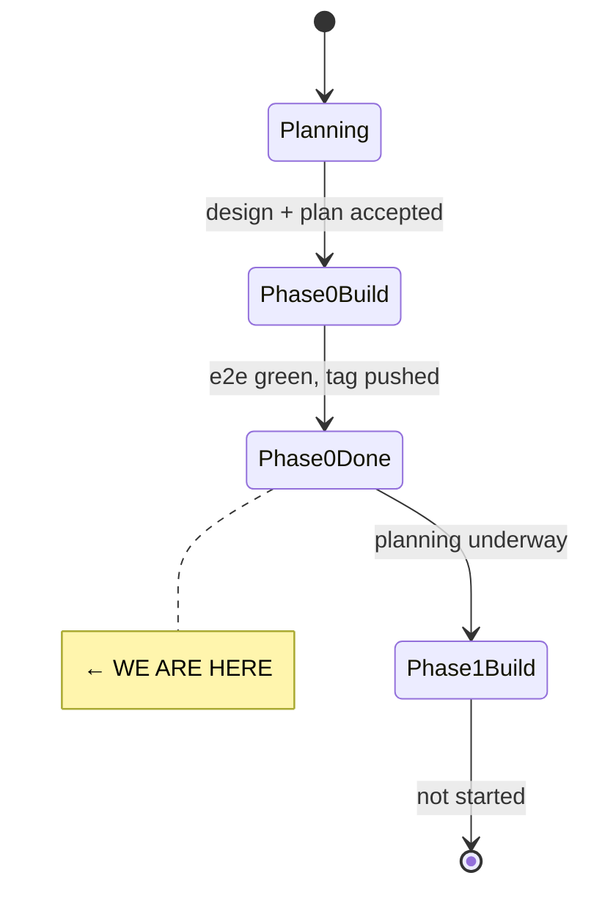
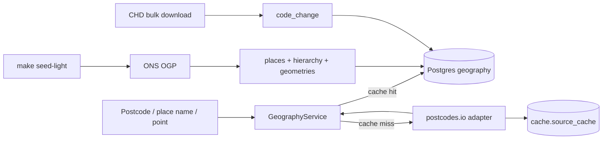

# State

> Last updated: 2026-05-10
> Phase: **0 — repo, schema, geography spine** (complete, tag `v0.1.0-phase-0`).

## System State Diagram

## Component Status

| Component | Status | Notes |
|-----------|--------|-------|
| Repo scaffolding (uv, Makefile, .env, Docker, CI) | ✅ Done | |
| Postgres + PostGIS in Docker Compose | ✅ Done | Ports 5433/8001 to avoid local conflict. |
| Five-schema Postgres (geography/catalogue/data/cache/corpus) | ✅ Done | 4 alembic migrations, restricted role on `corpus.raw_record`. |
| Indicator + source catalogue (`catalogue/*.yaml`) | ✅ Done | sources.yaml aligned with indicators.yaml IDs. |
| FastAPI app + `/healthz` + lifespan catalogue load | ✅ Done | |
| `ons.geography` loaders (places, hierarchy, geometries, code change) | ✅ Done | URLs partly unverified — see ADR-0001. Live verification gated to nightly. |
| `postcodes.io` adapter (lookup + upsert) | ✅ Done | Cached via `cache.source_cache`, default 30-day TTL. |
| GeographyService (postcode/name/hierarchy/point) | ✅ Done | |
| Seed CLI (`make seed`, `make seed-light`) | ✅ Done | |
| GitHub Actions CI + nightly live workflow | ✅ Done | |
| Smoke deploy config (Caddy + cloudflared runbook) | ✅ Done | Tom executes the actual deploy. |

Status markers: ⏳ Not started · 🔧 In progress · ✅ Done · 🚫 Blocked · ⚠️ Needs attention.

## Data Flow (Phase 0)

## Dependencies

| Dependency | Status | Notes |
|------------|--------|-------|
| Postgres + PostGIS 16 | Working | Containerised; `infra/docker-compose.yml`. |
| ONS Open Geography Portal | Probable | URLs pinned in ADR-0001; some unverified. |
| ONS Code History Database | Working | Bulk download via `OnsGeographyCodeChangeLoader`. |
| postcodes.io | Working | Public, no auth. |
| GitHub Actions | Configured | `ci.yml` + `nightly.yml`. |

## Known follow-ups for Phase 1

- Verify and pin the unverified OGP service URLs in ADR-0001 against a real run.
- LSOA + MSOA layers are excluded from `make seed-light` for speed. `--full` covers them.
- Mac mini smoke deploy depends on Tom adding the cloudflared ingress rule per `docs/runbook-mac-mini-deploy.md`.
- Phase 1 plans (Nomis Census, MHCLG IMD, MCP tool surface) — see next plan doc.
