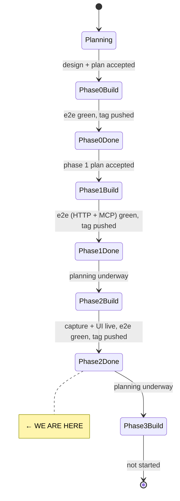
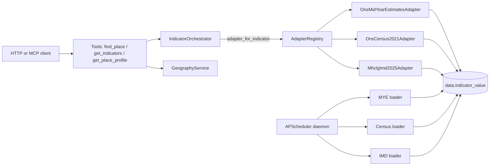

# State

> Last updated: 2026-05-11
> Phase: **2 — capture + sanitisation + UI** (complete, tag `v0.3.0-phase-2`).

## System State Diagram

## Component Status

| Component | Status | Notes |
|-----------|--------|-------|
| Repo scaffolding (uv, Makefile, .env, Docker, CI) | ✅ Phase 0 | |
| Postgres + PostGIS in Docker Compose | ✅ Phase 0 | Ports 5433/8001. |
| Five-schema Postgres + restricted role | ✅ Phase 0 | |
| Indicator + source catalogue (`catalogue/*.yaml`) | ✅ Phase 0 | |
| FastAPI app + `/healthz` + lifespan catalogue load | ✅ Phase 0 | |
| `ons.geography` loaders (places, hierarchy, geometries, code change) | ✅ Phase 0 | OGP URLs partly unverified — nightly live tests confirm. |
| `postcodes.io` adapter (lookup + upsert) | ✅ Phase 0 | |
| GeographyService (postcode/name/hierarchy/point) | ✅ Phase 0 | |
| **`IndicatorValue` + `SourceRef` contracts + `SourceAdapter` Protocol** | ✅ Phase 1 | |
| **`LoaderAdapter.fetch_indicator` default reading `data.indicator_value`** | ✅ Phase 1 | cache_status derived from `loader_run` age vs cron. |
| **`PassthroughAdapter.fetch_indicator` + `SourceRefFactory`** | ✅ Phase 1 | |
| **`NomisClient` + ons.mid_year_estimates + ons.census2021 adapters** | ✅ Phase 1 | `population.total` (MYE) and `population.households.lone_parent_share` (Census) verified live 2026-05-11. Other Census TS table IDs still plausible-but-untested. |
| **`mhclg.imd2025` + `mhclg.imd2019` adapters (xlsx parse + LSOA→LTLA aggregation)** | ✅ Phase 1 | Both editions verified live 2026-05-11. 2025 reads File 5 (Scores); 2019 reads File 2. Aggregation parameterised by source_id. |
| **`IndicatorOrchestrator` (concurrent fan-out + level enforcement + dedup)** | ✅ Phase 1 | |
| **Three tools: `find_place`, `get_indicators`, `get_place_profile`** | ✅ Phase 1 | Single implementation, two transports. |
| **HTTP routes `/v1/tools/*`, `/v1/tools`, `/v1/sources`, `/v1/catalogue/indicators`** | ✅ Phase 1 | |
| **Error envelope middleware** | ✅ Phase 1 | Maps `OrchestrationError` subclasses to design §4 codes/status. |
| **MCP server mounted at `/mcp` over SSE** | ✅ Phase 1 | FastMCP; tools registered against `app.state`. |
| **CORS locked to `SOUNDINGS_UI_ORIGIN`** | ✅ Phase 1 | |
| **Loader daemon (APScheduler) + `loader` Docker service** | ✅ Phase 1 | `--once <source_id>` for ops debugging. |
| **`/healthz` reports stale loader runs** | ✅ Phase 1 | Flips degraded if any source older than 1.5× refresh_cadence. |
| **Exponential retry on transient loader failures** | ✅ Phase 1 | 1s/4s/16s on 5xx + connect errors; no retry on 4xx. |
| Seed CLI (`make seed`, `make seed-light`) | ✅ Phase 0 + 1 | Now seeds MYE + Census + IMD after the geography spine. |
| GitHub Actions CI + nightly live workflow | ✅ Phase 0 | Live tests run nightly; MYE + Census + IMD live tests added. |
| Smoke deploy config (Caddy + cloudflared runbook) | ✅ Phase 0 | |
| **Capture middleware + RawRecordWriter (stub + raw in one txn)** | ✅ Phase 2 | Raw ASGI middleware; tracks sanitiser tasks via app.state.background_tasks. |
| **Sanitisation pipeline (6 rules + pipeline runner)** | ✅ Phase 2 | direct identifiers, fine geography, spaCy NER, small orgs, normalise, validate. Pipeline runner flags review_status=flagged at total_fires ≥ 2. |
| **Migration 0005 — review_status + sanitisation_rules_version** | ✅ Phase 2 | |
| **SanitiserWorker + startup replay** | ✅ Phase 2 | Replay capped at 4 concurrent spaCy invocations. |
| **POST /v1/capture/consent + /v1/capture/feedback** | ✅ Phase 2 | Issues session/consent/sector cookies; feedback enforces same-session ownership. |
| **FullConsentRateLimiter (60/hour silent downgrade)** | ✅ Phase 2 | |
| **Resend alerts + 30-day raw_record retention cron** | ✅ Phase 2 | Daily 04:00 UTC; failure paths route through send_alert. |
| **Publication CLI (`make publish-corpus`)** | ✅ Phase 2 | CSV + JSONL + SHA-256 manifest + local git tag; deterministic byte output. |
| **Astro 5 UI (`/`, `/place/[id]`, `/about`)** | ✅ Phase 2 | SSR everywhere. Typed `lib/api.ts` mirrors Pydantic shapes; ADR-0005. |
| **Caddyfile path routing for /v1, /mcp, ui** | ✅ Phase 2 | Replaces the Phase 0 placeholder. |
| **`/healthz` capture-pipeline freshness** | ✅ Phase 2 | Pending backlog + stuck >1h checks. |

Status markers: ⏳ Not started · 🔧 In progress · ✅ Done · 🚫 Blocked · ⚠️ Needs attention.

## Data Flow (Phase 1)

## Dependencies

| Dependency | Status | Notes |
|------------|--------|-------|
| Postgres + PostGIS 16 | Working | Containerised. |
| ONS Open Geography Portal | Probable | URLs pinned in ADR-0001; some unverified. |
| ONS Code History Database | Working | Bulk download via `OnsGeographyCodeChangeLoader`. |
| ONS Nomis API | Working | Field codes verified for the indicators exercised by Phase 1 live tests; rest plausible-but-untested. |
| MHCLG IMD download | Working | 2025 (File 5) and 2019 (File 2) both verified live 2026-05-11. |
| postcodes.io | Working | |
| GitHub Actions | Configured | |

## Known follow-ups (Phase 3 and beyond)

- **Production sanitisation pipeline missing rules**: app.py lifespan
  composes only StripDirectIdentifiers + NormaliseAskerPurpose +
  ValidateConsentLevel. StripFineGeographyInFreeText,
  StripPersonalNamesViaNER, and StripSmallOrgNames exist + are tested
  but not wired into the runtime pipeline. Bundling that wire-up with
  loading the DB-backed name lists from `geography.place` and
  `data.organisation` is the next sanitiser improvement.
- **No Vitest in CI**: GitHub Actions runs the Python suite only.
  `cd ui && npm test` runs locally. CI extension is a small workflow
  patch.
- **No Playwright UI e2e**: deferred per the Phase 2 plan
  "best-effort" provision.
- **IMD 2025 deciles/ranks**: only Scores (File 5) loaded for 2025;
  Decile/Rank in File 2 not yet wired.
- **Census TS-table IDs**: indicators beyond `lone_parent_share` are
  pinned with plausible IDs, not yet exercised.
- **Backblaze B2 publication push**: deferred per ADR-0004.
- **Permanent-orphan pending stubs**: edge case from ADR-0003; cron
  hard-deleting pending stubs older than 60 days is a Phase 3 task.
- **`compare_places` and `get_trend` tools** — Phase 3 plan.
- **Observable Plot charts** — deferred to Phase 3 per ADR-0007.
