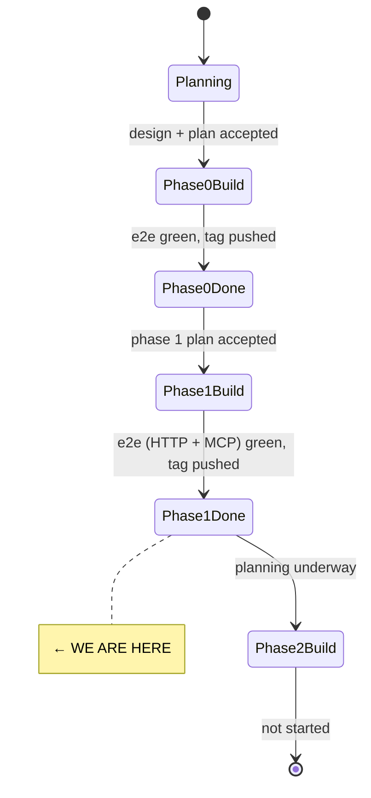
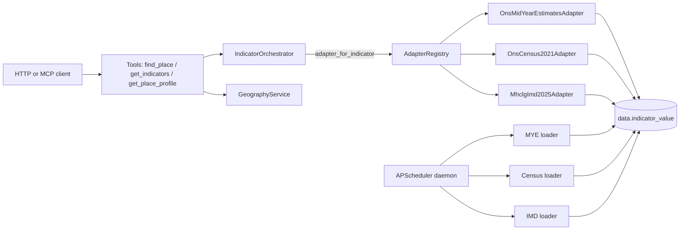

# State

> Last updated: 2026-05-10
> Phase: **1 — indicator pipeline + three tools** (complete, tag `v0.2.0-phase-1`).

## System State Diagram

## Component Status

| Component | Status | Notes |
|-----------|--------|-------|
| Repo scaffolding (uv, Makefile, .env, Docker, CI) | ✅ Phase 0 | |
| Postgres + PostGIS in Docker Compose | ✅ Phase 0 | Ports 5433/8001. |
| Five-schema Postgres + restricted role | ✅ Phase 0 | |
| Indicator + source catalogue (`catalogue/*.yaml`) | ✅ Phase 0 | |
| FastAPI app + `/healthz` + lifespan catalogue load | ✅ Phase 0 | |
| `ons.geography` loaders (places, hierarchy, geometries, code change) | ✅ Phase 0 | OGP URLs partly unverified — nightly live tests confirm. |
| `postcodes.io` adapter (lookup + upsert) | ✅ Phase 0 | |
| GeographyService (postcode/name/hierarchy/point) | ✅ Phase 0 | |
| **`IndicatorValue` + `SourceRef` contracts + `SourceAdapter` Protocol** | ✅ Phase 1 | |
| **`LoaderAdapter.fetch_indicator` default reading `data.indicator_value`** | ✅ Phase 1 | cache_status derived from `loader_run` age vs cron. |
| **`PassthroughAdapter.fetch_indicator` + `SourceRefFactory`** | ✅ Phase 1 | |
| **`NomisClient` + ons.mid_year_estimates + ons.census2021 adapters** | ✅ Phase 1 | mappings unverified; nightly live tests confirm against real Nomis. |
| **`mhclg.imd2025` adapter (xlsx parse + LSOA→LTLA aggregation)** | ✅ Phase 1 | URL pinned in ADR-0002. |
| **`IndicatorOrchestrator` (concurrent fan-out + level enforcement + dedup)** | ✅ Phase 1 | |
| **Three tools: `find_place`, `get_indicators`, `get_place_profile`** | ✅ Phase 1 | Single implementation, two transports. |
| **HTTP routes `/v1/tools/*`, `/v1/tools`, `/v1/sources`, `/v1/catalogue/indicators`** | ✅ Phase 1 | |
| **Error envelope middleware** | ✅ Phase 1 | Maps `OrchestrationError` subclasses to design §4 codes/status. |
| **MCP server mounted at `/mcp` over SSE** | ✅ Phase 1 | FastMCP; tools registered against `app.state`. |
| **CORS locked to `SOUNDINGS_UI_ORIGIN`** | ✅ Phase 1 | |
| **Loader daemon (APScheduler) + `loader` Docker service** | ✅ Phase 1 | `--once <source_id>` for ops debugging. |
| **`/healthz` reports stale loader runs** | ✅ Phase 1 | Flips degraded if any source older than 1.5× refresh_cadence. |
| **Exponential retry on transient loader failures** | ✅ Phase 1 | 1s/4s/16s on 5xx + connect errors; no retry on 4xx. |
| Seed CLI (`make seed`, `make seed-light`) | ✅ Phase 0 + 1 | Now seeds MYE + Census + IMD after the geography spine. |
| GitHub Actions CI + nightly live workflow | ✅ Phase 0 | Live tests run nightly; MYE + Census + IMD live tests added. |
| Smoke deploy config (Caddy + cloudflared runbook) | ✅ Phase 0 | |

Status markers: ⏳ Not started · 🔧 In progress · ✅ Done · 🚫 Blocked · ⚠️ Needs attention.

## Data Flow (Phase 1)

## Dependencies

| Dependency | Status | Notes |
|------------|--------|-------|
| Postgres + PostGIS 16 | Working | Containerised. |
| ONS Open Geography Portal | Probable | URLs pinned in ADR-0001; some unverified. |
| ONS Code History Database | Working | Bulk download via `OnsGeographyCodeChangeLoader`. |
| ONS Nomis API | Probable | Field codes pinned in `catalogue/nomis-mapping.yaml`; unverified, nightly. |
| MHCLG IMD download | Probable | URL pinned in ADR-0002; falls back to 2019 if 2025 not yet published. |
| postcodes.io | Working | |
| GitHub Actions | Configured | |

## Known follow-ups for Phase 2

- Verify `nomis-mapping.yaml` dataset/measure/cell codes against live Nomis (first nightly).
- Verify ADR-0002 IMD URL against gov.uk (first IMD loader run).
- Capture pipeline (raw_record + sanitised question_record) — Phase 2 plan.
- Minimal `/` and `/place/{id}` UI — Phase 2 plan.
- `compare_places` and `get_trend` tools — Phase 3 plan.
