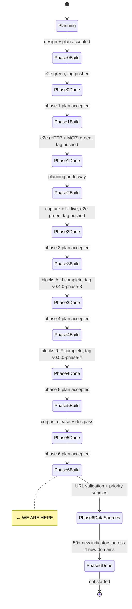
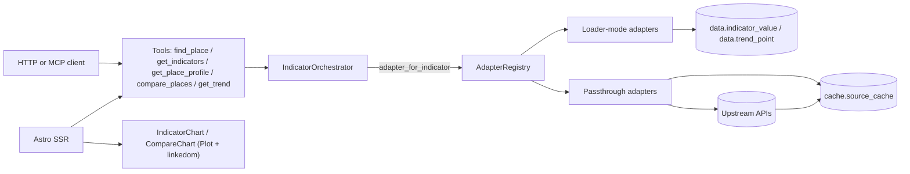

# State

> Last updated: 2026-06-29
> Status: **Phase 6 — ask interface deepened.** Give Food food-bank source + neighbourhood-granularity ask improvements shipped on `feat/neighbourhood-granularity`; live test still pending API key.

## System State Diagram

## Component Status

| Component | Status | Notes |
|-----------|--------|-------|
| Repo scaffolding (uv, Makefile, .env, Docker, CI) | ✅ Phase 0 | |
| Postgres + PostGIS in Docker Compose | ✅ Phase 0 | Ports 5433/8001. |
| Five-schema Postgres + restricted role | ✅ Phase 0 | |
| Indicator + source catalogue (`catalogue/*.yaml`) | ✅ Phase 0 | |
| FastAPI app + `/healthz` + lifespan catalogue load | ✅ Phase 0 | |
| `ons.geography` loaders (places, hierarchy, geometries, code change) | ✅ Phase 0 | OGP URLs partly unverified — nightly live tests confirm. |
| `postcodes.io` adapter | ✅ Phase 0 | |
| GeographyService | ✅ Phase 0 | |
| Loader + passthrough adapter contracts | ✅ Phase 1 | |
| `NomisClient` + ons.mid_year_estimates + ons.census2021 adapters | ✅ Phase 1 | `population.total` + `population.households.lone_parent_share` verified live; rest plausible. |
| `mhclg.imd2025` + `mhclg.imd2019` adapters | ✅ Phase 1 | Both editions verified live 2026-05-11. |
| `IndicatorOrchestrator.fetch` (concurrent fan-out + level enforcement + dedup) | ✅ Phase 1 | |
| Three Phase 1 tools (`find_place`, `get_indicators`, `get_place_profile`) | ✅ Phase 1 | |
| HTTP + MCP transports for the Phase 1 tools | ✅ Phase 1 | Mounted at `/v1/tools/*` and `/mcp`. |
| Capture pipeline (6 sanitisation rules) + replay + alerts + corpus publish | ✅ Phase 2 | |
| Astro UI (`/`, `/place/[id]`, `/about`) | ✅ Phase 2 | SSR everywhere. |
| **`OhidFingertipsAdapter`** | ✅ Phase 3 (Block B) | Live test green for Stockton female LE. |
| **`DwpStatXploreAdapter`** | ✅ Phase 3 (Block C) | Code shipped; live test skips without `STATXPLORE_API_KEY`. Cube IDs plausible-but-unverified. |
| **`DfeExploreAdapter`** | ✅ Phase 3 (Block D) | FSM UUID real; KS4 + persistent absence placeholders. Live test fails-closed by design. |
| **`PoliceUkAdapter`** | ✅ Phase 3 (Block E) | Centroid + rolling 12-month aggregation. METHODOLOGY_CAVEAT asserted verbatim. Live test green for Stockton recorded crime. |
| **`OnsApsAdapter`** | ✅ Phase 3 (Block F) | Reuses NomisClient; employment_rate verified live (NM_17_5 variable 45, measure 20599); other mapped indicators (unemployment, median pay, affordability) still plausible-but-unverified. |
| **`IndicatorOrchestrator.compare_places`** | ✅ Phase 3 (Block G) | Ranks against full peer universe; loader = SELECT, passthrough = fan-out with 200-budget caveat; supports percentile / rank / absolute / rate. |
| **`IndicatorOrchestrator.get_trend`** | ✅ Phase 3 (Block H) | Loader = SELECT from `data.trend_point`, passthrough = `adapter.fetch_trend`. `series_break:` prefix partitions catalogue caveats into `Trend.breaks_in_series`. |
| **`compare_places` + `get_trend` tools** | ✅ Phase 3 (Block G + H) | HTTP `/v1/tools/{compare_places,get_trend}` + FastMCP registrations; e2e via both transports. |
| **UI Observable Plot charts (linkedom polyfill)** | ✅ Phase 3 (Block I) | Sparklines per IndicatorCard on `/place/[id]`; `/compare` page with bar charts + percentile badges; `/about` updated. |
| **Phase 3 server e2e (`compare_places` + `get_trend` + Fingertips cache)** | ✅ Phase 3 (Block J) | Seeds 3 LTLAs + a Fingertips life-expectancy cache row, asserts ranked compare + ordered three-point trend. |
| **Browser smoke runbook** | ✅ Phase 3 (Block J) | `docs/runbook-phase-3-smoke.md` — gates the `v0.4.0-phase-3` tag. |
| **`v0.4.0-phase-3` tag** | ✅ Phase 3 | Delivered with Phase 4 merge. |
| **`PassthroughAdapter` extensions + `pre_warmer` daemon** | ✅ Phase 4 (Block 0) | `fetch_organisations` + `pre_warm_for_places` optional methods; new compose service. |
| **`OrganisationRef` + `GrantRef` contracts** | ✅ Phase 4 (Block 0) | Per design §4.6. |
| **`CharityCommissionLoader` (loader-mode by carve-out)** | ✅ Phase 4 (Block A) | Bulk register pulled monthly. API-first principle's documented exception: CC API v2 is detail-lookup only, no search-by-area endpoint. Writes data.organisation + data.organisation_operates_in + civil_society.active_charities_* aggregates. |
| **`ThreeSixtyGivingAdapter` (passthrough)** | ✅ Phase 4 (Block B) | Composes place-level grant aggregates by fanning out across CC charities in data.organisation. Three-layer cache (per-org aggregate + per-org grants + per-place grants); latest_grant_date filter skips orgs with no recent activity. Pre-warmer override drives weekly cache warming. Live test verified against Oxfam. |
|| **`FindThatCharityAdapter` (passthrough)** | ✅ Phase 4 (Block C) | Cross-jurisdiction lookup for Scotland/NI; fetch_organisations routes by place_id prefix. |
| **`find_organisations_in_place` tool** | ✅ Phase 4 (Block D) | HTTP route + MCP registration. Mixed-mode dispatch. Regression unit tests in `test_orchestrator_find_organisations.py`. |
| **UI Organisations section** | ✅ Phase 4 (Block E) | `OrganisationCard` + `OrganisationsSection` SSR-mounted on `/place/[id]`. Gated on E&W place_ids; FTC path exposed via the HTTP tool but not yet from the UI. `/about` mentions civil-society context. |
| **Phase 4 server-side e2e** | ✅ Phase 4 (Block F) | `test_phase_4_e2e.py` covers both CC + FTC dispatch via HTTP. Runs against `soundings_test` DB (see `make test-db-create`). |
|| **`v0.5.0-phase-4` tag** | ✅ Phase 4 | Delivered with Phase 4 merge. |
|| **Phase 5 — First monthly corpus release** | ✅ Phase 5 | Published 2026-05-24; see `docs/corpus/`. |
|| **Phase 5 — Doc pass** | ✅ Phase 5 | DRIs, error messages, inline docs reviewed. |
| **`get_civil_society_profile` tool + CivilSocietyPanel** | ✅ Phase 6 slice 1 | Total, income distribution + median/mean, registration cohort trend. CC loader extended to capture `latest_income`, `date_of_registration`, `date_of_removal`. |
|| **Phase 6 — New data sources** | 🔧 Planning | URL validation complete; priority: Ofcom, Ofsted, BEIS EPC, DEFRA Air, CQC, Land Registry, DfT. 50+ new indicators across 4 new domains (digital, environment, housing-extended, safety). |
| **Ask interface — `/v1/ask` + `/ask` page** | ✅ Phase 6 (ask) | Claude tool-use loop over existing tools. SSE streaming. 4 modes (open/summary/compare/insight). detect_insights SQL detector. AskBox on homepage + place page. |
| **Ask interface — live test** | ⏳ Pending | `@pytest.mark.live` test written; needs `ANTHROPIC_API_KEY` in GitHub Secrets for nightly CI. |
| **Give Food food-bank source** | ✅ Phase 6 (ask) | `adapters/givefood/` (client + adapter): trims the national food-bank dump, counts via point-in-polygon, map points + pre-warming. Replaces the retired OSM food-bank tag. `get_amenities_geometry` now routes each indicator to the adapter that owns it (per catalogue `source_id`), so food banks come from Give Food while schools/GPs stay on OSM. |
| **Neighbourhood granularity (ask)** | ✅ Phase 6 (ask) | New `get_sub_areas` tool returns LSOA/ward-level values for all children of a parent place in one call (with parent value for context) + `SubAreaTableBlock` answer block. `compare_places` gained `context_place_ids` (compare an LSOA against its LTLA average via `_build_context_comparison`, `is_context=True`, skips level enforcement). System prompt teaches Claude that "neighbourhood" = LSOA/ward. UI: AskBox + ask page + `ask_page.ts`. |

Status markers

## Data Flow (Phase 3)

## Dependencies

| Dependency | Status | Notes |
|------------|--------|-------|
| Postgres + PostGIS 16 | Working | Containerised. |
| ONS Open Geography Portal | Probable | URLs pinned in ADR-0001; some unverified. |
| ONS Code History Database | Working | |
| ONS Nomis API | Working | MYE + Census + APS employment verified; other field codes plausible. |
| MHCLG IMD downloads | Working | 2025 (File 5) + 2019 (File 2). |
| postcodes.io | Working | |
| OHID Fingertips API | Working | Stockton female LE live test green. |
| DWP Stat-Xplore | Auth-gated | Code paths shipped; needs `STATXPLORE_API_KEY` for live verification. |
| DfE Explore Education Statistics | Working | FSM dataset confirmed; other UUIDs pending live discovery. |
| data.police.uk | Working | Stockton recorded crime live test green; no auth. |
| GitHub Actions | Configured | Unit + integration on every push; nightly live workflow runs the live-marked tests. |

## Known follow-ups (Phase 4 and beyond)

- **`data.trend_point` not yet populated by loader-mode adapters**: the
  table exists and `get_trend` reads from it, but MYE / Census / IMD
  loaders don't write to it yet — passthrough adapters provide the only
  populated trends in Phase 3 prod. Phase 4 should wire trend writes
  during the loader pass.
- **Production sanitisation pipeline missing rules**: app.py lifespan
  composes only StripDirectIdentifiers + NormaliseAskerPurpose +
  ValidateConsentLevel. The other three rules exist + are tested but not
  wired.
- **Vitest in CI**: GitHub Actions runs the Python suite only; `cd ui &&
  npm test` runs locally. Trivial workflow addition.
- **Playwright UI e2e**: deferred per the Phase 2 plan "best-effort"
  provision.
- **IMD 2025 deciles/ranks**: only Scores (File 5) loaded for 2025.
- **Census TS-table IDs**: indicators beyond `lone_parent_share` are
  plausible-but-untested.
- **Nomis APS pay + affordability codes**: live-discover the dataset +
  variable IDs next time these indicators are exercised.
- **Stat-Xplore cube IDs**: unblock by adding `STATXPLORE_API_KEY` to
  GitHub Secrets, then iterate.
- **DfE EES KS4 + persistent absence UUIDs**: live discovery via the
  EES dataset metadata endpoint.
- **Police.uk smokes for violence + ASB**: only `crime.recorded_crime_rate`
  has a live test.
- **Backblaze B2 publication push**: deferred per ADR-0004.
- **Permanent-orphan pending stubs cron**: ADR-0003 edge case.
- **Observable Plot CompareChart polish**: percentile labels are
  positioned with a fixed offset; could improve readability with a
  tooltip layer.
